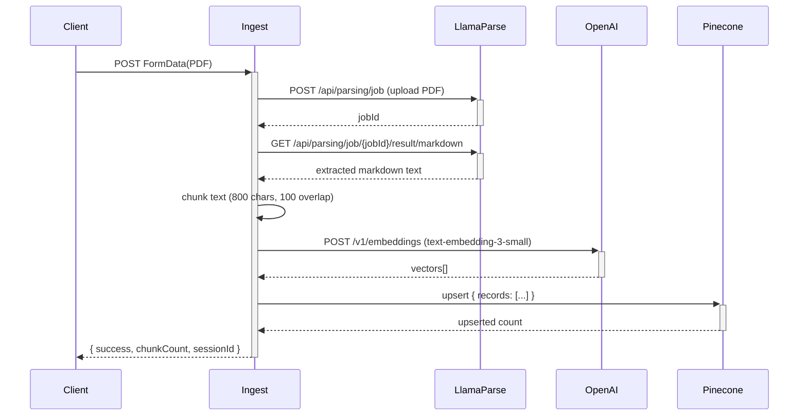

# Design Document: Anchor API Routes

## Overview

Four Next.js 15 App Router route handlers that power Anchor's backend. Each route is a standalone `route.ts` file under `app/api/`. All text generation uses `gpt-4o` via raw `fetch` against the OpenAI Chat Completions API (no SDK — consistent with the existing `app/api/session/route.ts` pattern). All routes return `NextResponse.json(...)` and follow a shared error shape `{ error: string }`.

The routes are:

| Route | Method | Purpose |
|---|---|---|
| `/api/mirror` | POST | Transcript + pathology → Night Note JSON |
| `/api/fear` | POST | Transcript → extract fear → persist to Appwrite |
| `/api/plan` | POST | Fear + cancer type + pathology → 72-hour Task plan |
| `/api/ingest` | POST | PDF → LlamaParse → chunk → embed → Pinecone |

---

## Architecture

```mermaid
flowchart TD
    Client -->|POST JSON| Mirror[/api/mirror]
    Client -->|POST JSON| Fear[/api/fear]
    Client -->|POST JSON| Plan[/api/plan]
    Client -->|POST FormData| Ingest[/api/ingest]

    Mirror -->|chat completion| GPT4o
    Fear -->|chat completion| GPT4o
    Fear -->|createDocument| Appwrite[(Appwrite\nfears collection)]
    Fear -.->|fallback payload| Client
    Plan -->|chat completion| GPT4o
    Ingest -->|parse PDF| LlamaParse
    Ingest -->|embeddings| OpenAIEmbed[OpenAI Embeddings]
    Ingest -->|upsert records| Pinecone[(Pinecone\nanchor / patient-docs)]
```

All four routes live entirely on the server. No shared singleton clients — each handler instantiates what it needs inline, keeping the files independent and easy to deploy individually.

---

## Components and Interfaces

### Shared: Error Response

Every route returns errors in this shape:

```ts
{ error: string }
```

HTTP status codes used across all routes:

| Status | Meaning |
|---|---|
| 200 | Success |
| 400 | Missing / invalid request field |
| 422 | Upstream parse failure (ingest only) |
| 500 | GPT parse failure, Pinecone failure, or unhandled exception |

### Shared: Cancer Type Validation

```ts
const VALID_CANCER_TYPES = ["colon", "breast", "lung"] as const;
type CancerType = typeof VALID_CANCER_TYPES[number];

function isValidCancerType(v: unknown): v is CancerType {
  return VALID_CANCER_TYPES.includes(v as CancerType);
}
```

Used by `/api/mirror` and `/api/plan`.

### Shared: GPT-4o Chat Completion Helper

Each route calls OpenAI directly via `fetch`. The pattern used throughout:

```ts
const res = await fetch("https://api.openai.com/v1/chat/completions", {
  method: "POST",
  headers: {
    Authorization: `Bearer ${process.env.OPENAI_API_KEY}`,
    "Content-Type": "application/json",
  },
  body: JSON.stringify({
    model: "gpt-4o",
    response_format: { type: "json_object" },
    messages: [{ role: "user", content: prompt }],
  }),
});
const data = await res.json();
const parsed = JSON.parse(data.choices[0].message.content);
```

`response_format: { type: "json_object" }` is used on all four routes to guarantee parseable output and avoid manual JSON extraction from prose.

---

### Route 1: `/api/mirror`

**File:** `app/api/mirror/route.ts`

**Request body:**
```ts
{
  transcript: string;       // caregiver's spoken rant
  pathologyText: string;    // extracted text from pathology PDF
  cancerType: "colon" | "breast" | "lung";
}
```

**Response (200):**
```ts
{
  mirror: string;       // empathetic 2nd-person restatement of fear
  ground: string;       // grounding statement
  actions: [string, string, string];  // exactly 3 actionable tasks
  fearSummary: string;  // 1-sentence fear summary
  fearQuote: string;    // verbatim excerpt from transcript
}
```

**Prompt design:** The system prompt instructs GPT-4o to:
- Write `mirror` in second person ("You are feeling…"), empathetic, not clinical
- Write `fearQuote` as a verbatim excerpt copied from the transcript — no paraphrase
- Write `actions` as exactly 3 concrete tasks doable within a few hours
- Ground the response in the `cancerType` and `pathologyText` context
- Return only valid JSON matching the schema above

**Validation flow:**
1. Parse body → 400 if `transcript` missing/empty
2. 400 if `cancerType` not in `["colon","breast","lung"]`
3. Call GPT-4o
4. Parse response → 500 if shape doesn't match
5. Return 200

---

### Route 2: `/api/fear`

**File:** `app/api/fear/route.ts`

**Request body:**
```ts
{
  transcript: string;
  sessionId: string;
  contextTag: string;
}
```

**Response (200, Appwrite success):**
```ts
{
  fearSummary: string;
  fearQuote: string;
  contextTag: string;   // echoed from request
}
```

**Response (200, Appwrite failure):**
```ts
{
  fearSummary: string;
  fearQuote: string;
  contextTag: string;
  localStorageFallback: {
    sessionId: string;
    timestamp: string;   // ISO UTC
    fearSummary: string;
    fearQuote: string;
    contextTag: string;
  }
}
```

**Appwrite write:** Uses the Appwrite Node SDK (`appwrite` v24). The `fears` collection ID must be set via env var `APPWRITE_FEARS_COLLECTION_ID`. The write is wrapped in `try/catch` — on failure the route still returns 200 with `localStorageFallback` populated.

```ts
import { Client, Databases, ID } from "appwrite";

const client = new Client()
  .setEndpoint(process.env.APPWRITE_ENDPOINT!)
  .setProject(process.env.APPWRITE_PROJECT_ID!);

const db = new Databases(client);

try {
  await db.createDocument(
    process.env.APPWRITE_DATABASE_ID!,
    process.env.APPWRITE_FEARS_COLLECTION_ID!,
    ID.unique(),
    { sessionId, timestamp: new Date().toISOString(), fearSummary, fearQuote, contextTag }
  );
} catch {
  // include localStorageFallback in response
}
```

**Validation flow:**
1. 400 if `transcript` missing/empty
2. 400 if `sessionId` missing/empty
3. Call GPT-4o to extract fear
4. Parse response → 500 if shape doesn't match
5. Attempt Appwrite write (try/catch)
6. Return 200 with or without `localStorageFallback`

---

### Route 3: `/api/plan`

**File:** `app/api/plan/route.ts`

**Request body:**
```ts
{
  fearSummary: string;
  cancerType: "colon" | "breast" | "lung";
  pathologyText: string;
}
```

**Response (200):**
```ts
{
  tonight: Task[];
  tomorrow: Task[];
  next48: Task[];
}

// Task shape:
type Task = {
  text: string;
  regretQuote?: string;  // optional first-person quote
}
```

**Prompt design:** The system prompt instructs GPT-4o to:
- Produce at least 1 Task in each bucket (`tonight`, `tomorrow`, `next48`)
- Tailor tasks specifically to the `cancerType` (colon / breast / lung)
- Ground tasks in the clinical context from `pathologyText`
- Optionally include `regretQuote` — a real-sounding first-person quote from someone who wished they'd done the task sooner
- Return only valid JSON matching the schema above

**Validation flow:**
1. 400 if `fearSummary` missing/empty
2. 400 if `cancerType` not in `["colon","breast","lung"]`
3. Call GPT-4o
4. Parse response → 500 if shape doesn't match or any bucket is empty
5. Return 200

---

### Route 4: `/api/ingest`

**File:** `app/api/ingest/route.ts`

**Request:** `multipart/form-data` with a `file` field containing a PDF.

**Response (200):**
```ts
{
  success: true;
  chunkCount: number;
  sessionId: string;
}
```

**Processing pipeline:**



**LlamaParse integration:** Uses the REST API directly via `fetch` (no SDK in package.json). Uploads the PDF as `multipart/form-data`, polls for job completion, retrieves markdown result.

**Chunking strategy:** Simple character-based sliding window — 800 characters per chunk, 100-character overlap. This keeps chunks within embedding token limits while preserving sentence context across boundaries.

**Pinecone upsert format (non-negotiable):**
```ts
await index.namespace("patient-docs").upsert({
  records: chunks.map((text, i) => ({
    id: `${sessionId}-chunk-${i}`,
    values: embeddings[i],
    metadata: { sessionId, chunkIndex: i, text },
  })),
});
```

Note: `{ records: [...] }` — NOT a raw array. This is a hard constraint from the steering file.

**Session ID:** If the request body includes a `sessionId` field alongside the file, it is used. Otherwise `uuid` generates one. The same `sessionId` is returned in the response and stored in each Pinecone record's metadata.

**Validation flow:**
1. 400 if no `file` field in FormData
2. Forward to LlamaParse → 422 if error or empty text returned
3. Chunk text
4. Embed all chunks via OpenAI
5. Upsert to Pinecone → 500 on failure
6. Return 200

---

## Data Models

### NightNote

```ts
type NightNote = {
  mirror: string;
  ground: string;
  actions: [string, string, string];
  fearSummary: string;
  fearQuote: string;
};
```

### FearExtraction (GPT output, before Appwrite write)

```ts
type FearExtraction = {
  fearSummary: string;
  fearQuote: string;
};
```

### FearRecord (Appwrite document)

```ts
type FearRecord = {
  sessionId: string;
  timestamp: string;       // ISO UTC datetime
  fearSummary: string;
  fearQuote: string;
  contextTag: string;
};
```

### Task

```ts
type Task = {
  text: string;
  regretQuote?: string;
};
```

### Plan

```ts
type Plan = {
  tonight: Task[];
  tomorrow: Task[];
  next48: Task[];
};
```

### PineconeChunkRecord

```ts
type PineconeChunkRecord = {
  id: string;              // `${sessionId}-chunk-${i}`
  values: number[];        // embedding vector
  metadata: {
    sessionId: string;
    chunkIndex: number;
    text: string;
  };
};
```

---

## Environment Variables

All variables are non-`NEXT_PUBLIC_`-prefixed for reliable server-side access.

| Variable | Used by | Description |
|---|---|---|
| `OPENAI_API_KEY` | all routes | OpenAI API key |
| `APPWRITE_ENDPOINT` | `/api/fear` | Appwrite API endpoint (e.g. `https://cloud.appwrite.io/v1`) |
| `APPWRITE_PROJECT_ID` | `/api/fear` | `69cc74de0025c73656de` |
| `APPWRITE_DATABASE_ID` | `/api/fear` | `69cc78030009929d9719` |
| `APPWRITE_FEARS_COLLECTION_ID` | `/api/fear` | ID of the `fears` collection |
| `APPWRITE_API_KEY` | `/api/fear` | Server-side Appwrite API key (for Node SDK auth) |
| `PINECONE_API_KEY` | `/api/ingest` | Pinecone API key |
| `LLAMA_CLOUD_API_KEY` | `/api/ingest` | LlamaParse API key |

---

## Error Handling

### Consistent error shape

All routes return `{ error: string }` for every non-200 response. No stack traces, no raw exception objects.

```ts
return NextResponse.json({ error: "transcript is required" }, { status: 400 });
```

### GPT parse failures

If `JSON.parse(data.choices[0].message.content)` throws, or if required fields are missing from the parsed object, the route returns 500:

```ts
return NextResponse.json({ error: "Failed to parse GPT response" }, { status: 500 });
```

Using `response_format: { type: "json_object" }` significantly reduces this risk, but the guard is still present.

### Appwrite failure (fear route only)

Appwrite write is wrapped in `try/catch`. On failure, the route does NOT return an error — it returns 200 with `localStorageFallback` so the client can persist the record to `localStorage` and retry later.

### LlamaParse failure (ingest route)

If LlamaParse returns a non-2xx status or the extracted text is empty/whitespace, the route returns 422 (Unprocessable Entity) — distinct from 500 to signal that the issue is with the uploaded content, not the server.

### Pinecone failure (ingest route)

Wrapped in `try/catch`. Returns 500 with `{ error: "Pinecone upsert failed" }`.

### Unhandled exceptions

Each route wraps its entire handler body in a top-level `try/catch` that returns 500:

```ts
} catch (err) {
  console.error("[/api/mirror]", err);
  return NextResponse.json({ error: "Internal server error" }, { status: 500 });
}
```

---

## Testing Strategy

Per the project steering file, no automated tests are written for this project. Routes are validated manually:

- Each route is exercised via `curl` or a REST client (e.g. Bruno, Postman) against the local dev server
- Happy path and each 400/422/500 branch are hit manually before marking a route complete
- Appwrite fallback is tested by temporarily providing an invalid collection ID
- Pinecone upsert format is verified by inspecting the Pinecone console after a test ingest
